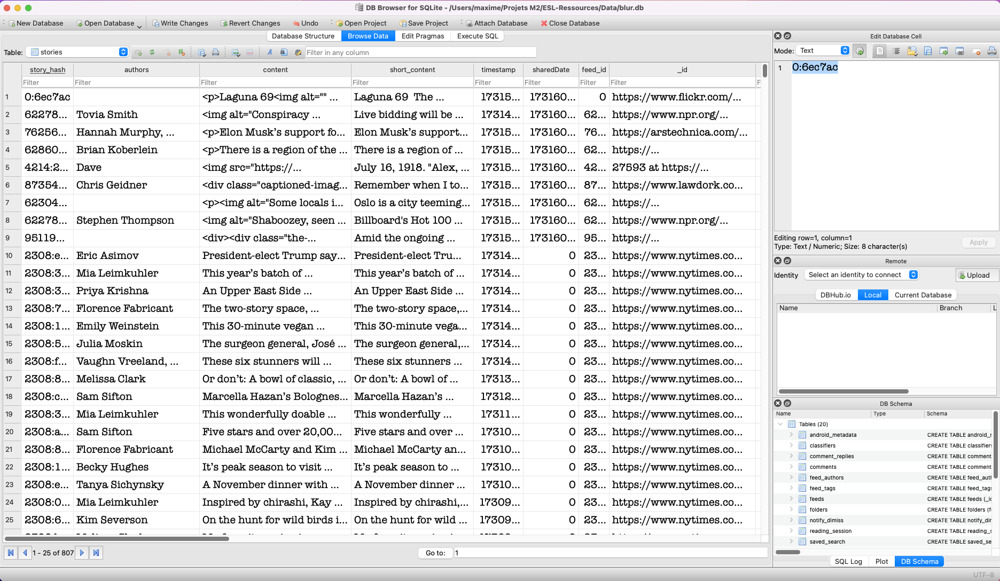

# Exemple de données

Fichiers de base de données dans la base de données du projet.

## Comment récupérer ses propres données ?

1. Lancer le projet dans Android Studio. Un émulateur (API 33+) doit avoir été configuré au préalable
2. Utiliser l'application (nécessite la création d'un compte)
3. Dans Android Studio, se rendre dans l'onglet `Device Explorer`, puis repérer le fichier `data/data/com.newsblur/databases/blur.db`
4. Click droit, `Save As`, puis sélectionner un répertoire pour l'enregistrement du fichier

## Comment lire les données ?

1. Télécharger [DB Browser for SQLite](https://sqlitebrowser.org/)
2. Ouvrir le programme
3. Glisser le fichier `.db` sur la fenêtre, ou `Fichier > Ouvrir une base de données` et ouvrir le fichier `.db`
4. Se rendre dans l'onglet `Parcourir les données`
5. Sélectionner la table pour laquelle on souhaite afficher les données