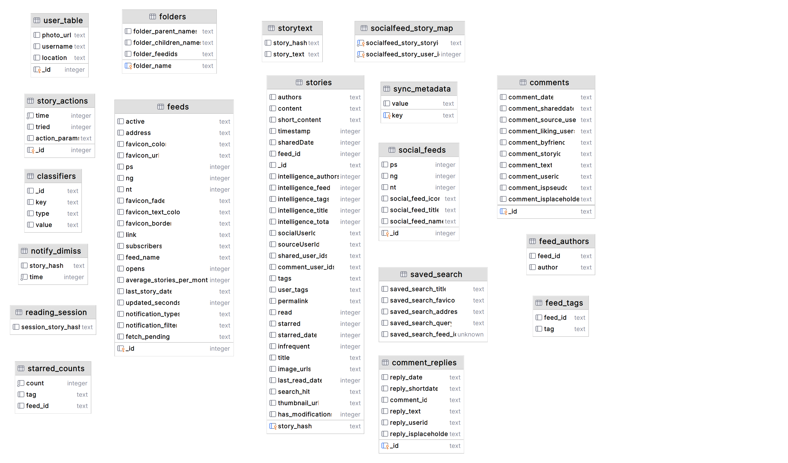
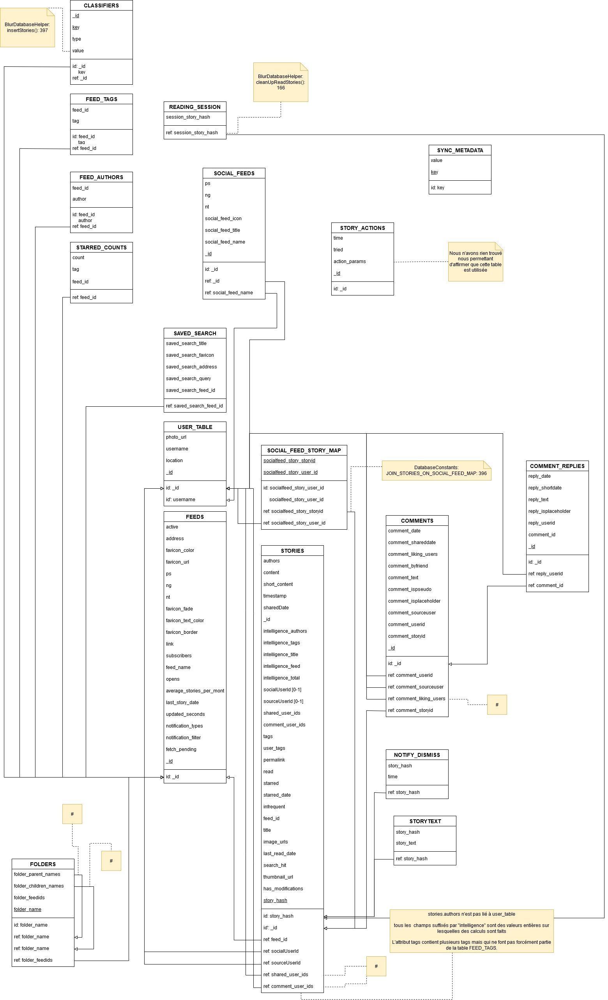
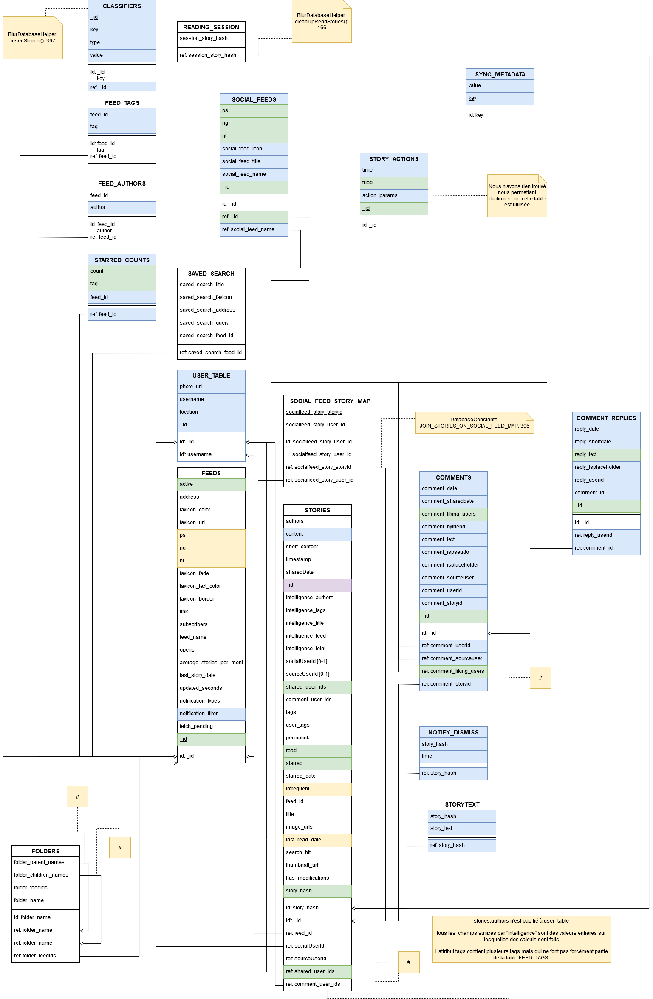
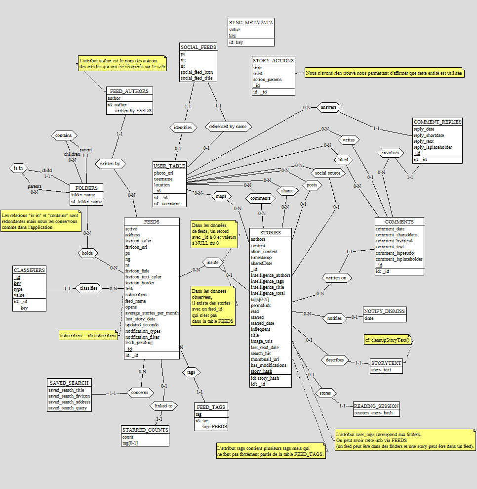

# Schémas

Ce répertoire contient les versions modifiables et versions exportées des différents schémas extraits/réalisés au cours du travail.

# Schéma physique

L'image du schéma physique a été récupérée grâce à [DataGrip](https://www.jetbrains.com/fr-fr/datagrip/).

# Schéma logique et sous-schéma logique

Les versions modifiables de ces schémas s'ouvrent avec [draw.io / diagrams.net](https://app.diagrams.net/)

|              Schéma logique            |                  Sous-schéma logique               |
| :------------------------------------: | :------------------------------------------------: |
|  |  |

# Schéma conceptuel

Le schéma conceptuel a été réalisé grâce à [DBMain](https://www.db-main.eu/).

